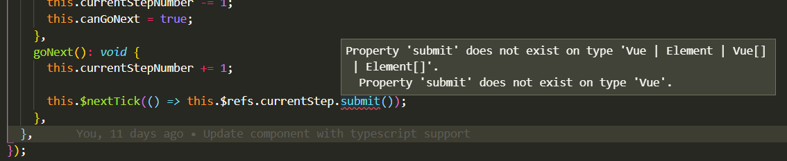
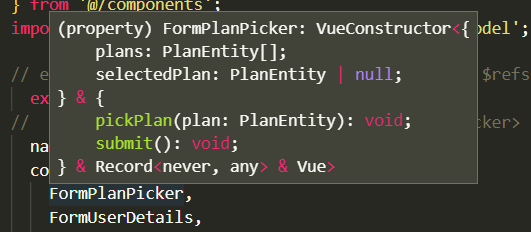

- Primer problema:

Al definir el componente con Typescript, al acceder a los métodos o datos del hijo mediante `refs`, saltará un error advirtiendo que no está definido dentro de `VueConstructor`.



Si nos fijamos en qué espera que sea `currentStep`, podemos pensar en varias soluciones.


Formas de solucionarlo:

1. Solución chachi:

  ```js
  this.$nextTick(() => (this.$refs.currentStep as InstanceType<typeof FormPlanPicker>).submit());
  ```

2. Solución fea:

  ```js
  this.$nextTick(() => (this.$refs.currentStep as any).submit());
  ```

3. Solución chachi 2:
Declaramos una clase que extenderá Vue con nuestro método submit y luego la usamos para definir el tipo.

```js
export class FormGeneral extends Vue {
  public submit!: () => void;
}

this.$nextTick(() => (this.$refs.currentStep as FormGeneral).submit());
```
4. Solución chachi 3:
Aprovechando la declaración de la clase anterior, extendemos el constructor de nuestro componente definiendo `currentStep` como una instancia de FormGeneral.

```js
export default (Vue as VueConstructor<
  Vue & {
    $refs: {
      currentStep: InstanceType<typeof FormGeneral>;
    };
  }
>).extend({
  ···
this.$nextTick(() => this.$refs.currentStep.submit());

```

A pesar de que la segunda solución definiéndolo como `any` es la más rápida, esto implica que podemos pasar cualquier cosa y no saltará ningún error antes de compilar.
Definiendo el tipado de la clase, obligamos a que cumpla el contrato de la definición.
Así que me he decantado por la tercera solución.

Ojo, podría haber dicho directamente que era de tipo `FormPlanPicker` y hubiera funcionado igual porque este componente contiene `submit`, sin embargo, como nuestro código lo estamos haciendo reutilizable con el resto de componentes, no me parece adecuado hacer uso de este parche.

